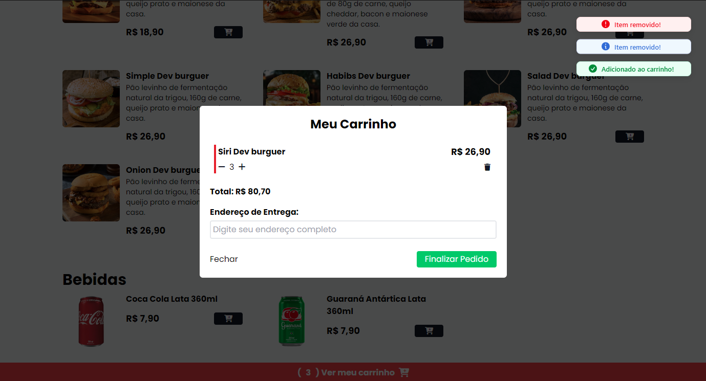

# Dev Burguer
- Uma Landing Page no formato de uma simples e-commerce de uma hamburgueria qualquer.

# Objetivo
- Usar da boa prática no códio jsx e na sua estilização com tailwindocss. 
    - A princípio era apenas para práticar a estilização com essa biblioteca, mas ao criar uma landing Page com produtos em sua vitrine, me desafiei á adicionar cada um dos produtos, clicando no seu botão, ao carrinho.

## Tecnologias
- HTML
- CSS
- JavaScript

## Bibliotecas
- React
- Tailwind
- Redux
- Redux-Logger
- Sonner

## API
- WhatsApp

# Utilização das Bibliotecas
- Desenvolvi toda a estrutura base em jsx.
- Sua estilização feita 99.9% em TaiwindoCSS, Trazendo um novo conceito e praticidade para mim no modo em como a responsividade é mais simples e de fácil manutenção. Até porque, com essa tecnologia utilizamos do método mobile first.
- A partir da base completa fui para os estudos de como criar um carrinho, sem tanta lógica e código em excesso com apenas JS puro. 
    - Como havia visto um pouco de Redux no meu curso do DevQuest, resolvi usá-lo, ao invés de um useContext por exemplo.
    - E depois de ler sobre e ver vídeos no youtube como apoio, consegui criar as pastas e arquivos que a boa prática nos fala.
    - Assim desenvolvendo 4 lógicas com Reducer: Adicionar o produto, incrementar e decrementar em quantidade e removê-lo do carrinho.
- Estudando sobre Redux, achei o redux-logger, que me auxiliou, e uito, no meu entendimento das actions e atualização do state com reducer.
- Para uma melhor visibilidade, encontrei a biblioteca sonner, que nos trás pop-ups de diferentes tipos. 
    - Nesse projeto utilizei do tipo success, info e error.
- Por fim, para mandar os produtos do carrinho, seu total e o endereço inserido, ultilizei da api gratuita do WhatsApp.
    - Onde seto o número que receberá a mensagem, e passo todos os dados pegos.
## Visual Final

